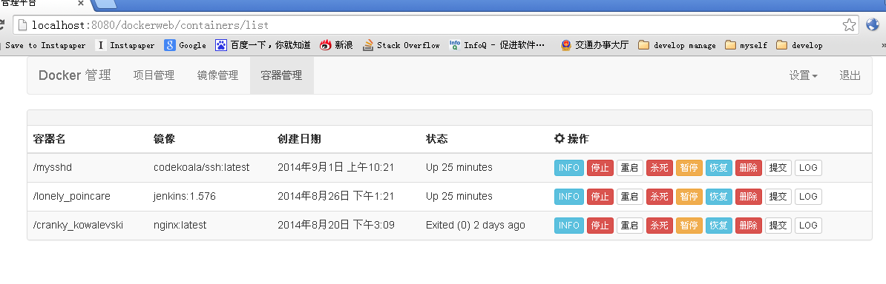

dockerweb
=========

web manager for docker
----------------------

snapshot

-----------------------------------------

build war:
-----------

1. git pull

2. mvn eclipse:eclipse

3. import project to eclipse

4. mvn package -Dmaven.test.skip=true

5. deploy dockerweb.war to tomcat/jetty/...

6. visit web from browser http://localhost:8080/dockerweb

7. user/password  docker/docker

